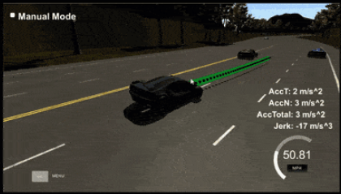

# CarND-Path-Planning-Project
Self-Driving Car Engineer Nanodegree Program



## Project Goals
In this project the goal is to safely navigate around a virtual highway with other traffic that is driving +-10 MPH of the 50 MPH speed limit. Udacity's simulator (can be downloaded [here](https://github.com/udacity/self-driving-car-sim/releases/tag/T3_v1.2)) provided the car's localization and sensor fusion data, and there is also a sparse map list of waypoints around the highway. The car should try to go as close as possible to the 50 MPH speed limit, which means passing slower traffic when possible, note that other cars will try to change lanes too. The car should avoid hitting other cars at all cost as well as driving inside of the marked road lanes at all times, unless going from one lane to another. The car should be able to make one complete loop around the 6946m highway. Since the car is trying to go 50 MPH, it should take a little over 5 minutes to complete 1 loop. Also the car should not experience total acceleration over 10 m/s^2 and jerk that is greater than 10 m/s^3.

## Basic Build Instructions

1. Clone this repo.
2. Make a build directory: `mkdir build && cd build`
3. Compile: `cmake .. && make`
4. Run it: `./path_planning`.

#### Dependencies

* cmake >= 3.5
  * All OSes: [click here for installation instructions](https://cmake.org/install/)
* make >= 4.1
  * Linux: make is installed by default on most Linux distros
  * Mac: [install Xcode command line tools to get make](https://developer.apple.com/xcode/features/)
  * Windows: [Click here for installation instructions](http://gnuwin32.sourceforge.net/packages/make.htm)
* gcc/g++ >= 5.4
  * Linux: gcc / g++ is installed by default on most Linux distros
  * Mac: same deal as make - [install Xcode command line tools]((https://developer.apple.com/xcode/features/)
  * Windows: recommend using [MinGW](http://www.mingw.org/)
* [uWebSockets](https://github.com/uWebSockets/uWebSockets)
  * Run either `install-mac.sh` or `install-ubuntu.sh`.
  * If you install from source, checkout to commit `e94b6e1`, i.e.
    ```
    git clone https://github.com/uWebSockets/uWebSockets
    cd uWebSockets
    git checkout e94b6e1
    ```

## Path Planning Algorithm

#### Perception and Sensor Fusion

First using the simulator's provided sensor readings, we need to perceive the roadway environment around the car. Specifically:

* What is our position?
* Are there any cars near us?
* Are these cars in front, to the left, or to the right of us?

Using telemetry and sensor fusion data, we can calculate our x, and y position on the highway, convert that to Frenet Coordinates (localization specifically within lane lines), and have a very accurate highway specific understanding of our environment.

And by performing similar steps on near ours, we can have a good understanding of what vehicle obstacles that surround us, and their specific position relative to ours.  This perception of our environment via sensor fusion, allows us to plan a safe path for our car.

#### Path Planning and Execution
Path planning and execution is deciding what course to take in response to our environment. As a breakdown:

* How much do we need to accelerate or decelerate?
* If we are behind a vehicle driving slower than we'd prefer, is it safe to change lanes?
* How do we make sure the transitions between accelerations and lanes do not create a safe and comfortable limit on jerk?

Much of the path planning is taken care of by having a slightly longer spline than suggested (35 N instead of the suggested 30 N). The length of the spline trajectory is partially calculated using the current velocity of the vehicle.  The problem with that, is at slower velocities the spline waypoint length is much shorter than at high velocities, which can lead to high level of jerk about 10 m/s^3 when the vehicle suddenly changes lanes. By slightly lengthening the spline, the planned path of the car elongates providing less severe curves into lane changes, which then eliminates lane change jerk.

I also added the maximum safe acceleration if our car is more than 30 meters behind the vehicle in front of it, and maximum safe deceleration if the car less than 20 meters behind any car in it's lane.  I also added a medium deceleration if the car is within 30 meters and going at least 60% of the speed maximum (49.5 MPH).  This was a simple attempt to limit the "yo-yo" effect of having the car switch from maximum deceleration and maximum acceleration that causes unhelpful and potentially dangerous sudden drops in speed (sometimes to the mid-20's on a 50 MPH road), to a slightly better following of the car in front while waiting to safely change lanes.


## Details

### Simulator
You can download the Term3 Simulator which contains the Path Planning Project from the [releases tab (https://github.com/udacity/self-driving-car-sim/releases/tag/T3_v1.2).


#### The map of the highway is in data/highway_map.txt
Each waypoint in the list contains  [x,y,s,dx,dy] values. x and y are the waypoint's map coordinate position, the s value is the distance along the road to get to that waypoint in meters, the dx and dy values define the unit normal vector pointing outward of the highway loop.

The highway's waypoints loop around so the frenet s value, distance along the road, goes from 0 to 6945.554.

Here is the data provided from the Simulator to the C++ Program

#### Main car's localization Data (No Noise)

["x"] The car's x position in map coordinates

["y"] The car's y position in map coordinates

["s"] The car's s position in frenet coordinates

["d"] The car's d position in frenet coordinates

["yaw"] The car's yaw angle in the map

["speed"] The car's speed in MPH

#### Previous path data given to the Planner

//Note: Return the previous list but with processed points removed, can be a nice tool to show how far along
the path has processed since last time.

["previous_path_x"] The previous list of x points previously given to the simulator

["previous_path_y"] The previous list of y points previously given to the simulator

#### Previous path's end s and d values

["end_path_s"] The previous list's last point's frenet s value

["end_path_d"] The previous list's last point's frenet d value

#### Sensor Fusion Data, a list of all other car's attributes on the same side of the road. (No Noise)

["sensor_fusion"] A 2d vector of cars and then that car's [car's unique ID, car's x position in map coordinates, car's y position in map coordinates, car's x velocity in m/s, car's y velocity in m/s, car's s position in frenet coordinates, car's d position in frenet coordinates.

## Tips

1. The car uses a perfect controller and will visit every (x,y) point it recieves in the list every .02 seconds. The units for the (x,y) points are in meters and the spacing of the points determines the speed of the car. The vector going from a point to the next point in the list dictates the angle of the car. Acceleration both in the tangential and normal directions is measured along with the jerk, the rate of change of total Acceleration. The (x,y) point paths that the planner recieves should not have a total acceleration that goes over 10 m/s^2, also the jerk should not go over 50 m/s^3. (NOTE: As this is BETA, these requirements might change. Also currently jerk is over a .02 second interval, it would probably be better to average total acceleration over 1 second and measure jerk from that.

2. There will be some latency between the simulator running and the path planner returning a path, with optimized code usually its not very long maybe just 1-3 time steps. During this delay the simulator will continue using points that it was last given, because of this its a good idea to store the last points you have used so you can have a smooth transition. previous_path_x, and previous_path_y can be helpful for this transition since they show the last points given to the simulator controller with the processed points already removed. You would either return a path that extends this previous path or make sure to create a new path that has a smooth transition with this last path.

A really helpful resource for doing this project and creating smooth trajectories was using http://kluge.in-chemnitz.de/opensource/spline/, the spline function is in a single hearder file is really easy to use.
